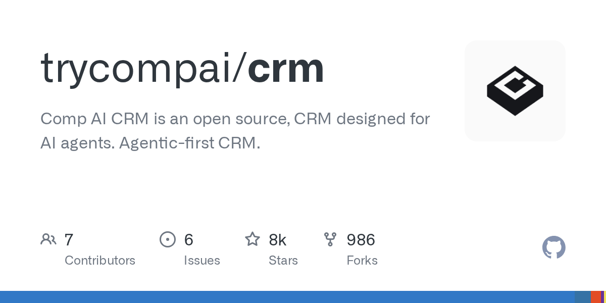
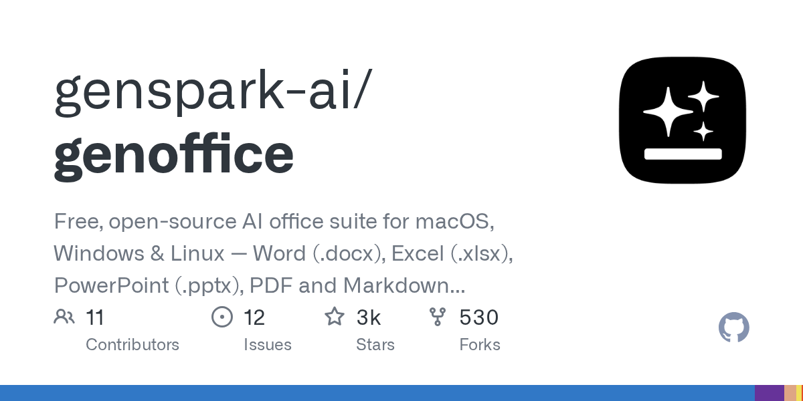
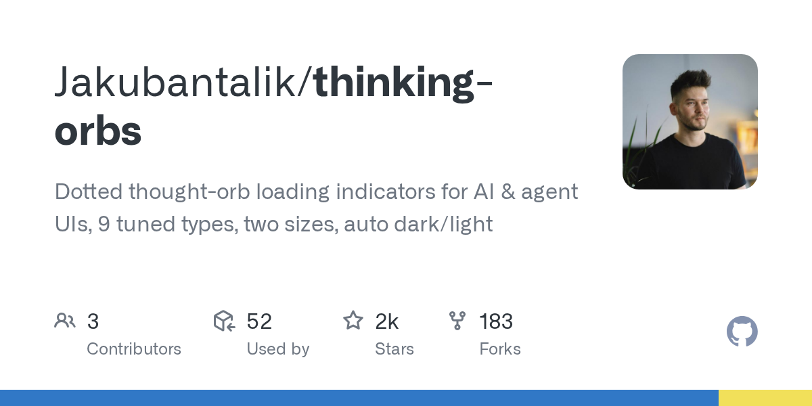
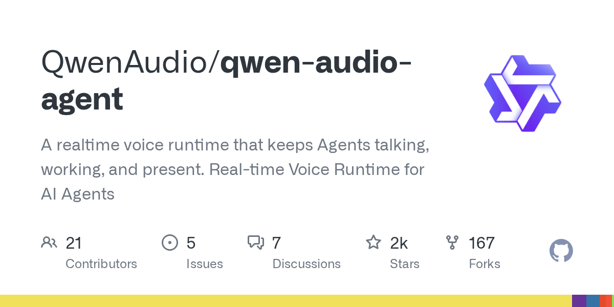
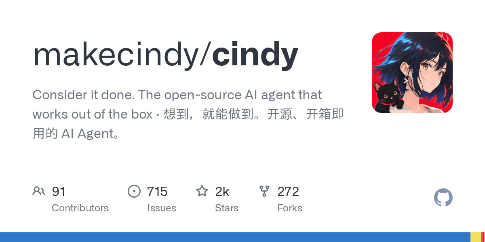

# AI 技能周报 2026-W33

本周报汇总近期值得关注的 AI Skill、Agent、MCP 与效率工具，帮助中文开发者快速了解它们的用途并完成初步筛选。内容基于公开仓库信息整理，使用前请自行核验。

检索窗口：近 30 天。精选 5 个未发布项目。

## 1. [trycompai/crm](https://github.com/trycompai/crm)

**近 13 天创建** · 8,406 Stars · TypeScript

**它是做什么的：**

Comp AI CRM 是一个面向 AI Agent 设计的开源 CRM 系统，主打 Agentic-first 理念，让 AI 代理能够直接驱动客户关系管理流程。

亮点：
- 专为 AI Agent 打造的开源 CRM，原生支持 Agentic 工作流
- 基于 TypeScript 开发，便于二次开发和集成
- 采用开源模式，可自托管并按需定制
- 由 Comp AI 团队维护，社区关注度较高（GitHub Star 超过 8000）

适用场景：
- 为 AI Agent 提供客户数据管理与交互记录能力
- 在自动化销售、客服或运营流程中作为 Agent 的 CRM 后端
- 企业或团队自建可定制的客户关系管理平台
- 作为研究 Agentic CRM 架构与 AI 驱动业务系统的参考实现

图片来源：GitHub Open Graph (https://opengraph.githubassets.com/ai-skill-weekly/trycompai/crm)

## 2. [genspark-ai/genoffice](https://github.com/genspark-ai/genoffice)

**近 13 天创建** · 2,999 Stars · TypeScript

**它是做什么的：**

GenOffice 是一款开源、跨平台的 AI 办公套件，基于 Electron 构建，支持在 macOS、Windows 和 Linux 上编辑 Word、Excel、PowerPoint、PDF 和 Markdown 文档，并内置 AI Agent 辅助处理办公任务。

亮点：
- 完全开源免费，支持 macOS、Windows 和 Linux 三大桌面平台
- 覆盖 Word、Excel、PowerPoint、PDF 与 Markdown 五种主流办公文档格式
- 基于 Electron 与 TypeScript 构建，便于二次开发和定制
- 内置 AI Agent，可在文档编辑场景中提供智能化辅助
- 面向个人和团队作为 Microsoft Office 的轻量替代方案

适用场景：
- 需要统一处理 Word、Excel、PPT、PDF 与 Markdown 的个人或团队办公场景
- 希望使用开源工具替代商业办公套件、降低软件采购成本的开发者与中小企业
- 在 macOS、Windows 或 Linux 桌面环境下进行跨平台文档编辑
- 为现有文档处理流程接入 AI Agent，实现自动化写作、整理与排版
- 作为 Electron + TypeScript 项目参考，用于构建自定义办公类桌面应用

图片来源：GitHub Open Graph (https://opengraph.githubassets.com/ai-skill-weekly/genspark-ai/genoffice)

## 3. [Jakubantalik/thinking-orbs](https://github.com/Jakubantalik/thinking-orbs)

**近 24 天创建** · 2,358 Stars · TypeScript

**它是做什么的：**

Thinking Orbs 是一个面向 AI 与智能体界面的点阵思维球加载动画组件库，提供 9 种调优样式与两种尺寸，并自动适配深色与浅色主题。

亮点：
- 内置 9 种经过调优的加载动画样式，可按场景选择不同节奏与视觉风格
- 提供 sm 与 lg 两种尺寸，方便在不同界面密度中嵌入
- 自动识别深色与浅色主题，无需手动切换配色
- 基于 TypeScript 开发，类型友好，易于在现代前端项目中集成
- 专为 AI 对话与 Agent 界面设计，契合思考、等待与流式响应等场景

适用场景：
- 在 AI 聊天或 Agent 应用中作为思考中、生成中的加载指示器
- 为多步骤 Agent 流程提供阶段性的视觉反馈
- 在深色与浅色主题切换的界面中保持一致的加载体验
- 作为可复用的 UI 组件集成到 React、Vue 等前端项目
- 用于演示页或产品页中替代传统 spinner，提升品牌质感

图片来源：GitHub Open Graph (https://opengraph.githubassets.com/ai-skill-weekly/Jakubantalik/thinking-orbs)

## 4. [QwenAudio/qwen-audio-agent](https://github.com/QwenAudio/qwen-audio-agent)

**近 18 天创建** · 2,123 Stars · JavaScript

**它是做什么的：**

QwenAudio/qwen-audio-agent 是一个面向 AI Agent 的实时语音运行时，让 Agent 能够持续进行语音对话并保持在线状态。它在 Agent 与语音通道之间提供低延迟的语音识别与语音合成能力，使 Agent 可以像真人一样边听边说、边工作边交流。

亮点：
- 实时语音运行时：专为 AI Agent 设计的低延迟语音通道，支持边听边说、持续在线的交互模式
- 端到端语音能力：集成语音识别（ASR）与语音合成（TTS），打通语音输入到 Agent 再到语音输出的完整链路
- 面向 Agent 生态：与 ACP、Claude Code、Codex、OpenCode 等主流 Agent 与编码工具兼容，可作为语音接入层
- 开发者友好：使用 JavaScript 实现，便于在 Node.js 与前端环境中集成和二次开发
- 开源可扩展：基于 QwenAudio 开源体系，开发者可自定义语音模型、提示词与交互流程

适用场景：
- 为 Claude Code、Codex、OpenCode 等编码 Agent 增加语音交互能力，实现边说边写代码
- 为客服、销售等对话 Agent 提供实时语音通道，替代传统文字聊天界面
- 在本地或私有化部署中构建可定制的语音助手，集成到 IDE、终端或 Web 应用
- 作为研究平台，探索 Agentic AI 在多模态、实时语音场景下的交互模式
- 为无障碍或移动场景提供语音优先的 Agent 接入方式，解放双手操作

图片来源：GitHub Open Graph (https://opengraph.githubassets.com/ai-skill-weekly/QwenAudio/qwen-audio-agent)

## 5. [makecindy/cindy](https://github.com/makecindy/cindy)

**近 22 天创建** · 2,062 Stars · TypeScript

**它是做什么的：**

Cindy 是一款开源、开箱即用的 AI Agent 桌面应用，基于 Electron 与 React Native 构建，支持 macOS、Windows、iOS 与 Android 等多平台。它通过集成 Claude Code、Codex 等大模型能力，让用户用自然语言即可驱动 Agent 完成各类任务。

亮点：
- 跨平台覆盖：基于 Electron 与 React Native，同时支持桌面端（macOS、Windows）与移动端（iOS、Android）。
- 开箱即用：作为开源 AI Agent，无需复杂配置即可启动使用，降低上手门槛。
- 多模型集成：内置对 Claude Code、Codex 等主流 LLM 与编程 Agent 的支持。
- TypeScript 全栈实现：项目主体使用 TypeScript 开发，便于二次定制与扩展。
- 自然语言驱动：通过自然语言指令让 Agent 执行任务，强调“想到，就能做到”的交互理念。

适用场景：
- 个人开发者希望快速拥有一个本地化的 AI Agent 桌面或移动端入口。
- 需要在 macOS、Windows、iOS、Android 之间统一使用 AI Agent 体验的用户。
- 希望基于 Claude Code、Codex 等模型构建自定义 Agent 工作流的开发者。
- 对 Electron + React Native 跨端架构感兴趣、想参考实现的工程师。
- 希望对 Agent 行为进行二次开发或私有化部署的开源贡献者。

图片来源：GitHub Open Graph (https://opengraph.githubassets.com/ai-skill-weekly/makecindy/cindy)

---

本周报仅整理公开信息，不代表安全审计或使用推荐；引入项目前请核对许可证、权限和数据处理方式。
