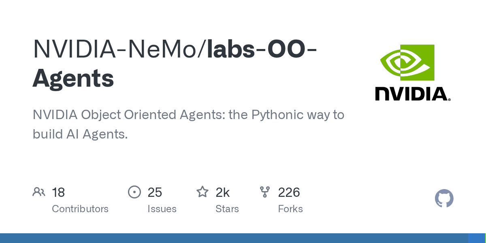
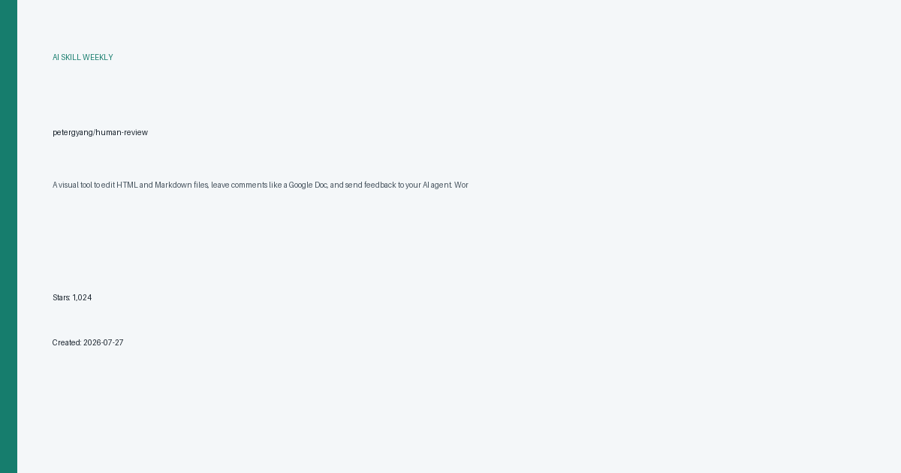

# AI 技能周报 2026-W34

本周报汇总近期值得关注的 AI Skill、Agent、MCP 与效率工具，帮助中文开发者快速了解它们的用途并完成初步筛选。内容基于公开仓库信息整理，使用前请自行核验。

检索窗口：近 30 天。精选 5 个未发布项目。

## 1. [NVIDIA-NeMo/labs-OO-Agents](https://github.com/NVIDIA-NeMo/labs-OO-Agents)

**近 27 天创建** · 1,657 Stars · Python

**它是做什么的：**

NVIDIA NeMo 推出的面向对象智能体框架，用 Python 面向对象的方式构建和组合 AI Agent，强调以类与对象组织 Agent 逻辑，便于复用、扩展和工程化集成。

亮点：
- 采用面向对象范式编写 Agent，将行为、状态与工具封装在类中，结构清晰且易于继承复用
- 由 NVIDIA NeMo 团队开源，依托 NeMo 生态在模型与推理能力上的积累
- 提供 Pythonic 的 API，降低 Agent 框架的学习与接入成本
- 支持对 Agent 进行模块化组合，便于构建复杂多步骤工作流
- 面向生产场景设计，强调可维护性与可扩展性

适用场景：
- 快速搭建可复用的自定义 AI Agent 并集成到现有 Python 项目
- 在企业应用中以面向对象方式组织多 Agent 协作与工具调用流程
- 作为 NeMo 生态的一部分，用于需要结合大模型的自动化任务编排
- 教学与研究场景中演示 Agent 的结构化设计与工程化实现

图片来源：GitHub Open Graph (https://opengraph.githubassets.com/ai-skill-weekly/NVIDIA-NeMo/labs-OO-Agents)

## 2. [VictorTaelin/OptMem](https://github.com/VictorTaelin/OptMem)

**近 22 天创建** · 1,259 Stars · Python

**它是做什么的：**

OptMem 是一个面向 AI Agent 的轻量级永久记忆方案，通过约 426 token 的提示词与配套脚本，让 Agent 在不依赖外部数据库的情况下获得跨会话的稳定记忆能力。

亮点：
- 极简集成：仅需一段约 426 token 的提示词加一个脚本即可接入，开箱即用
- 无外部依赖：不依赖向量数据库或第三方存储，记忆以文本形式持久化
- 跨会话持久：让 AI Agent 在多次对话或重启后仍能保留上下文与历史信息
- 可定制性强：提示词结构清晰，便于开发者按需调整记忆策略与字段
- 资源占用低：相比传统 RAG 或向量库方案，token 与算力开销更小

适用场景：
- 为个人或小型 AI Agent 项目快速添加长期记忆能力
- 在受限环境（如边缘设备、低 token 预算）中实现持久化上下文
- 作为教学或实验样例，帮助开发者理解 Agent 记忆机制的设计思路
- 用于本地脚本类 Agent，避免部署和维护向量数据库的复杂度
- 在多轮对话产品中保持用户偏好、历史任务等信息的连续性

图片来源：本地信息卡 (本地生成)

## 3. [petergyang/human-review](https://github.com/petergyang/human-review)

**近 20 天创建** · 1,024 Stars · JavaScript

**它是做什么的：**

human-review 是一个面向 AI Agent 工作流的可视化反馈工具，让用户像编辑 Google Doc 一样在浏览器中批注 HTML 和 Markdown 文件，并将结构化评论回传给 Claude Code、Codex 等 AI 编程助手，实现人在回路的协作审阅。

亮点：
- 可视化批注界面：直接在浏览器中打开 HTML 或 Markdown 文件，以类似 Google Doc 的方式高亮选区并添加评论
- 结构化反馈回传：评论以可解析的格式发送给 AI Agent，便于模型理解修改位置与意图
- 兼容主流 AI 编程工具：可作为 Claude Code、Codex 等 AI 编程助手的扩展组件嵌入现有工作流
- 支持 HTML 与 Markdown 双格式：覆盖文档、报告、博客等常见内容类型的审阅场景
- 人在回路设计：把人工审阅环节无缝接入 AI 自动生成流程，提升输出质量与可控性

适用场景：
- AI 生成文档或网页后，由人工在浏览器中逐段批注，再让 AI Agent 根据评论自动修订
- 团队使用 Claude Code 或 Codex 开发项目时，对生成的 Markdown 报告或 HTML 页面进行可视化评审
- 内容创作者借助 AI 起草文章后，通过可视化批注快速给出修改意见并回传给 AI 继续迭代
- 作为 Human-in-the-Loop 中间层，在自动化流水线中插入人工把关环节，降低 AI 输出风险

图片来源：本地信息卡 (本地生成)

## 4. [miuuyy/codex-chatgpt-web](https://github.com/miuuyy/codex-chatgpt-web)

**近 21 天创建** · 987 Stars · TypeScript

**它是做什么的：**

一个把 ChatGPT Web（含 Pro）封装为 Codex 原生模型的桥接工具，让 Codex 能突破使用额度限制，获得上下文、工具调用、流式输出和图像等能力。

亮点：
- 将 ChatGPT Web 作为后端接入 Codex，绕过 Codex 的使用额度限制
- 支持上下文保持、工具调用、流式响应和图像输入输出
- 基于 TypeScript 实现，使用 Playwright 自动化浏览器与 Responses API 对接
- 兼容 ChatGPT Pro 账号，提供 MCP 相关能力扩展
- 面向 macOS 等本地开发环境，便于在 Codex 应用中直接使用

适用场景：
- 在 Codex 中使用 ChatGPT Pro 模型而消耗 Pro 额度而非 Codex 额度
- 需要长上下文或多模态（图像）输入输出的开发任务
- 希望把 ChatGPT Web 的能力接入到现有 Codex 工作流的开发者
- 在本地 macOS 环境搭建自定义 AI 编程助手后端
- 通过 MCP 扩展为 Codex 增加更多工具和外部能力

图片来源：本地信息卡 (本地生成)

## 5. [pireel/pireel](https://github.com/pireel/pireel)

**近 27 天创建** · 931 Stars · TypeScript

**它是做什么的：**

Pireel 是一个开源 AI 视频剪辑工具，作为剪映和 ChatCut 的替代方案，可通过 MCP 协议被任意 AI Agent 驱动，实现对话式或自动化的视频编辑。

亮点：
- 开源替代剪映与 ChatCut，降低商业工具依赖
- 支持 MCP 协议，可被任意 AI Agent 调用和编排
- 聚焦 AI 视频场景，涵盖字幕、对话剪辑、关键帧（hyperframes）、口播（talking-head）等能力
- 基于 TypeScript 开发，便于二次开发和集成

适用场景：
- 通过 AI Agent 自动生成视频字幕与剪辑
- 用自然语言指令驱动视频编辑流程
- 作为开源底座二次开发定制化视频工具
- 集成到自动化内容生产流水线中

图片来源：本地信息卡 (本地生成)

---

本周报仅整理公开信息，不代表安全审计或使用推荐；引入项目前请核对许可证、权限和数据处理方式。
